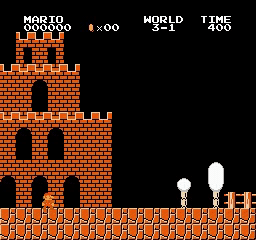
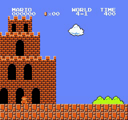
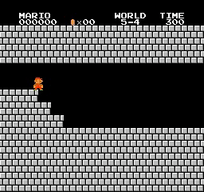
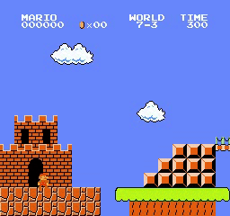

### Introduction

Implemented with Proximal Policy Optimization (PPO), my Python source code showcases the application of AI in mastering Super Mario Bros. The focus lies on training an agent through the PPO algorithm as detailed in the Proximal Policy Optimization Algorithms paper. The agent's performance is notable, successfully completing 31 out of 32 levels, exceeding initial expectations. This achievement highlights the efficacy of AI in gaming scenarios.

## PPO in SuperMarioBros in action : 

  
  
  
   
  
  
  
   
  
  
  
   
  
  
  
   
  
  
  
   
  
  
  
   
  
  
  
   
  
  
   
  <i>PPO results</i>

### Refer the paper
Proximal Policy Optimization (PPO) algorithm introduced in the paper **Proximal Policy Optimization Algorithms** [paper](https://arxiv.org/abs/1707.06347).
