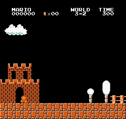
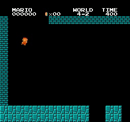
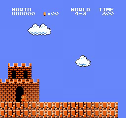
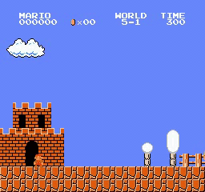
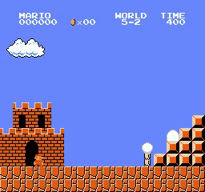
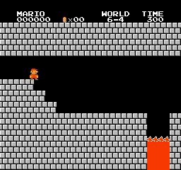
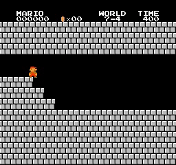
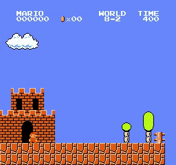

### Introduction

Through the implementation of Proximal Policy Optimization (PPO) and A3C respectively, I transformed Mario into an AI-driven gaming sensation, conquering levels with precision. This win underscores my commitment and ingenuity in machine learning, spotlighting the remarkable capabilities of AI within the gaming world.

Here is my python source code for training an agent to play super mario bros. By using Proximal Policy Optimization (PPO) algorithm introduced in the paper **Proximal Policy Optimization Algorithms** [paper](https://arxiv.org/abs/1707.06347).

Talking about performance, my PPO-trained agent could complete 31/32 levels, which is much better than what I expected at the beginning. 

For your information, PPO is the algorithm proposed by OpenAI and used for training OpenAI Five, which is the first AI to beat the world champions in an esports game. Specifically, The OpenAI Five dispatched a team of casters and ex-pros with MMR rankings in the 99.95th percentile of Dota 2 players in August 2018.

## PPO in SuperMarioBros in action : 

  
  
  
   
  
  
  
   
  
  
  
   
  
  
  
   
  
  
  
   
  
  
  
   
  
  
  
   
  
  
   
  <i>PPO results</i>

## Read More:

 I have released my A3C implementation ([A3C code](https://github.com/Malav5372/SuperMarioA3C/blob/719716cba68bf9da859c9fc103c6db6ea0bcd959/SuperMarioA3C/README.md)) for training an agent to play super mario bros. Although the trained agent could complete levels quite fast and quite well (at least faster and better than I played :sweat_smile:), it still did not totally satisfy me. The main reason is, agent trained with A3C could only complete 19/32 levels, no matter how much I fine-tuned and tested. It motivated me to look for a new approach.

## How to use my code

With my code, you can:

* **Train your model** by running `python train.py`. For example: `python train.py --world 5 --stage 2 --lr 1e-4`
* **Test your trained model** by running `python test.py`. For example: `python test.py --world 5 --stage 2`

**Note**: If you got stuck at any level, try training again with different **learning rates**. You could conquer 31/32 levels like what I did, by changing only **learning rate**. Normally I set **learning rate** as **1e-3**, **1e-4** or **1e-5**. However, there are some difficult levels, including level **1-3**, in which I finally trained successfully with **learning rate** of **7e-5** after failed for 70 times.

## Why there is still level 8-4 missing?

In world 4-4, 7-4 and 8-4, map consists of puzzles where the player must choose the correct the path in order to move forward. If you choose a wrong path, you have to go through path you visited again. With some hardcore setting for the environment, the first 2 levels are solved. But the last level has not been solved yet.
